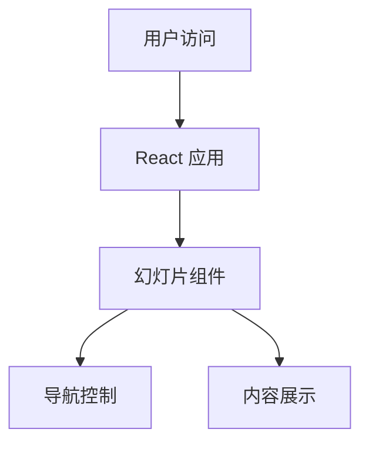

## 1. Architecture Design
纯前端单页应用，使用 React + Vite + TailwindCSS 构建，无后端依赖。

## 2. Technology Description
- Frontend: React@18 + TypeScript + tailwindcss@3 + vite
- Initialization Tool: vite-init
- Backend: None
- Database: None

## 3. Route Definitions
| Route | Purpose |
|-------|---------|
| / | 主展示页面 |

## 4. API Definitions
无需后端API

## 5. Server Architecture Diagram
无需后端

## 6. Data Model
不适用
