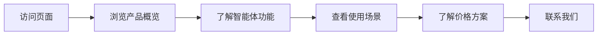

## 1. Product Overview
为两个英语学习智能体创建一个精美、框架清晰的展示PPT，用于功能介绍、使用帮助和产品推销。目标用户为家长、学生及教育机构。
- 主要目的：展示智能体的核心功能，吸引目标用户并指导如何使用产品。
- 市场价值：帮助用户快速了解产品优势，提升产品转化率。

## 2. Core Features

### 2.1 User Roles
| Role | Registration Method | Core Permissions |
|------|---------------------|------------------|
| Visitor | None | View all presentation slides |

### 2.2 Feature Module
1. **封面页**: 产品标题、副标题、品牌标识
2. **产品概览**: 两个智能体的介绍
3. **少儿英语智能体**: 功能详解
4. **口译训练智能体**: 功能详解
5. **核心优势**: 产品亮点对比
6. **使用场景**: 实际应用案例
7. **使用流程**: 操作指南
8. **用户反馈**: 效果展示
9. **价格方案**: 套餐介绍
10. **联系我们**: 行动呼吁

### 2.3 Page Details
| Page Name | Module Name | Feature description |
|-----------|-------------|---------------------|
| 封面页 | Hero section | 大标题、副标题、品牌logo、视觉效果 |
| 产品概览 | Overview | 两个智能体的简介卡片 |
| 少儿英语智能体 | Kids English | 功能列表、特点说明、图标 |
| 口译训练智能体 | Interpreter Training | 功能列表、特点说明、图标 |
| 核心优势 | Advantages | 对比表格、数据可视化 |
| 使用场景 | Use Cases | 场景图片、文字说明 |
| 使用流程 | How to use | 步骤演示、截图 |
| 用户反馈 | Testimonials | 用户评价、评分展示 |
| 价格方案 | Pricing | 套餐对比、CTA按钮 |
| 联系我们 | Contact | 联系方式、二维码 |

## 3. Core Process
用户访问页面 → 浏览幻灯片（可左右滑动或点击导航）→ 了解产品功能 → 查看价格方案 → 联系购买/使用

## 4. User Interface Design
### 4.1 Design Style
- 主色调：蓝色渐变（#3b82f6 到 #8b5cf6），代表专业和创新
- 辅助色：白色和浅灰色作为背景
- 按钮风格：圆角、渐变背景、悬停效果
- 字体：标题使用 Playfair Display，正文使用 Inter
- 布局风格：卡片式布局，居中对齐，大量留白
- 图标风格：线性图标，简洁现代

### 4.2 Page Design Overview
| Page Name | Module Name | UI Elements |
|-----------|-------------|-------------|
| 封面页 | Hero section | 大标题渐变文字、副标题、背景图案、动画效果 |
| 产品概览 | Overview | 双列卡片布局、图标、渐变背景 |
| 少儿英语智能体 | Kids English | 功能网格、卡通插图、暖色调 |
| 口译训练智能体 | Interpreter Training | 功能列表、专业插图、冷色调 |
| 核心优势 | Advantages | 数据卡片、对比图表、图标 |
| 使用场景 | Use Cases | 轮播图、场景卡片 |
| 使用流程 | How to use | 步骤指示器、箭头、截图占位 |
| 用户反馈 | Testimonials | 引用卡片、用户头像、评分星标 |
| 价格方案 | Pricing | 对比表格、高亮推荐套餐 |
| 联系我们 | Contact | 大CTA按钮、二维码占位、社交链接 |

### 4.3 Responsiveness
- 桌面端：全屏展示，左右导航按钮
- 平板端：自适应布局
- 移动端：垂直滑动，触摸优化

### 4.4 3D Scene Guidance
不适用
